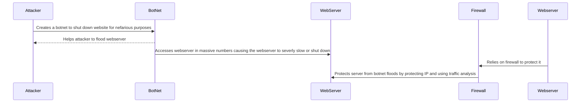

# Steps of a DDoS Attack
1. An attacker creates a botnet, a group of devices that are infected by malware and thus controlled by the attacker, to flood a webserver, software that allows users to acess websites.
2. Once botnet is created, they are unleashed to the webserver by the attacker all at once to flood and disrupt it. This is called a DDoS (Distributed Denial-of-Service) attack.
3. Webserver can use what's called a firewall, a common defensive system that watches server traffic, to find the harmful botnets, protecting the server.
4. Firewall helps protect webserver by blocking the IP and using traffic analysis.
5. DDoS attack is stopped by firewall and webserver begins process of repairing its infrastructure.
